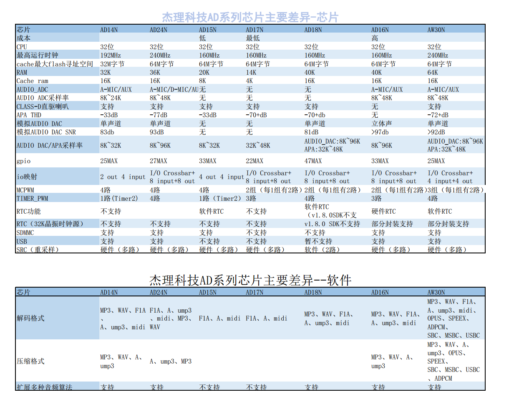

# fw-AD24N
About Firmware for Generic MCU SDK（AD24N series）, Support AD24N

[tag download]:https://gitee.com/Jieli-Tech/AD24N/tags
[tag_badgen]:https://img.shields.io/github/v/tag/Jieli-Tech/fw-AD24N?style=plastic&labelColor=ffffff&color=informational&label=Tag&

# fw-AD24N_SDK   [![tag][tag_badgen]][tag download]

[中文](./README.md) | EN

firmware for Generic MCU SDK（AD24 series）

This repository contains the Jieli source code, aims at helping the developers for the toy & generic MCU applications.
It must be combined with lib.a and the repositories that use the same
naming convention to build the provided samples and to use the additional
subsystems and libraries.

Getting Started
------------

Welcome to JL open source! See the `Introduction to SDK` for a high-level overview,
and the documentation's `Getting Started Guide` to start developing.

Toolchain
------------

How to get the `JL Toolchain` and setup the build enviroment,see below

* Complie Tool ：install the JL complie tool to setup the build enviroment, [download link](https://pan.baidu.com/s/1f5pK7ZaBNnvbflD-7R22zA) code: `ukgx`
* Compiler invitation code: 4VlZaQCq-lImlZX2u-GBeCs501-ektNxDGu

* USB updater : program flash tool to download the `hex` file to the target board, please accquire the tool form the [link](https://item.taobao.com/item.htm?spm=a1z10.1-c-s.w4004-22883854875.5.504d246bXKwyeH&id=620295020803) and check the related configuration and [document](.doc/stuff/ISD_CONFIG.INI配置文件说明.pdf)

Documentation
------------

* Chipset brief : [SoC datasheet](./doc)

* Product Select Guide : [SoC Select Guide.pdf](./doc杰理科技32位AD系列语音MCU选型表.pdf)

* SDK Version: [SDK History](./doc/AD24N_SDK_发布版本信息.pdf)

* SDK introduction : [SDK quick start guide](./doc/AD24N_SDK手册_v1.0.pdf)

* SDK Online documentation : [SDK Online documentation](https://doc.zh-jieli.com/AD24/zh-cn/master/index.html)

* SDK architure : [SDK module architure ](./doc/)

* Video resource: [Video resource](https://space.bilibili.com/3493277347088769/dynamic)

* FAE support document: [FAE support](https://gitee.com/jieli-tech_fae/fw-jl)

Build
-------------
Select a project to build. The following folders contains buildable projects:

* APP_TOY: ./sdk/AD24N_voice_toy.cbp, usage: 

Comming Soon：
-------------

SDK support Codeblock to build to project,make sure you already setup the enviroment

* Codeblock build : enter the project directory and find the `.cbp`,double click and build.

* Makefile build : `apps/app_cfg` select the target you want to build,double click the `make_prompt` and excute `make`

  `before build the project make sure the USB updater is connect and enter the update mode correctly`

Hardware
-------------

* EV Board ：(https://shop321455197.taobao.com/?spm=a230r.7195193.1997079397.2.2a6d391d3n5udo)

* Production Tool : massive prodution and program the SoC, please accquire the tool from the [link](https://item.taobao.com/item.htm?spm=a1z10.1-c-s.w4004-22883854875.8.504d246bXKwyeH&id=620941819219) and check the releated [doc](./doc/stuff/烧写器使用说明文档.pdf)

Packaging, audio file conversion, midi and other general audio tools
-------------

* [download link](https://pan.baidu.com/s/1ajzBF4BFeiRFpDF558ER9w#list/path=%2F) code: `3jey`
  
SDK function
-------------
* Supports decoding and playback of built-in FLASH
* Support the decoding and playback of external FLASH
* Support decoding MIO function
* Support the decoding and playback of the two formats of .a/.b/.e, .f1a/.f1b/.f1c
* Support MIDI playback
* Support variable speed modulation (but need to adjust the system clock above 100Mhz)
* Supports up to .a/.b/.e + .f1a/.f1b/.f1c two channels of audio decoding and playback at the same time
* DAC supports PWM differential output and external single-ended power amplifier
* DAC supports 8K, 12k, 16K, 24K, 32K sampling rates
* Support hardware resampling
* Shutdown power consumption 1.7uA+
  
MCU information
-------------
* Support decoding and playback of built-in FLASH
* Support decoding and playback of external FLASH
* Support decoding MIO function
* Support decoding and playback of three formats: .a/.b/.e, .f1a/.f1b/.f1c, and ump3
* Support MIDI playback
* Support sydfs, norfs, and simple_fat file systems;
* Support AD, infrared, touch and other buttons;
* Support hardware SRC resampling;
* Support ANS noise reduction, speed speed change, ECHO reverberation, vo_pitch change, voice_changer change, PCM_EQ and other sound effect algorithms;
* Support up to .a/.b/.e + .f1a/.f1b/.f1c + .f1a/.f1b/.f1c three-way audio decoding and playback at the same time
* DAC supports PWM differential output and external single-ended amplifier
* Class-D amplifier (APA) Output, optional 8K, 11.025k, 12k, 16k, 22.05k, 24k, 32K, 44.1k, 48K sampling rate;
* Support analog DAC output, optional 8K, 11.025k, 12k, 16k, 22.05k, 24k, 32k, 44.1k, 48k, 64k, 88.2k, 96k sampling rate; (some chip packages do not have DAC pins and cannot use this function)
* Support 10-bit SARADC driver;
* Support vm power-off memory function;
* Support MIO function and key prompt sound;
* Support system FLASH software and hardware write protection;
* Support system FLASH DTR function;
* Support dual backup upgrade;
* Support soft shutdown Softoff, power consumption 2uA+;
* Supports wake-up in place and low power consumption Powerdown, power consumption 19uA+;

Community
--------------

* [Dingtalk Group](./doc/stuff/dingtalk.jpg)

Disclaimer
------------

AD24N_SDK supports development with AD24 series devices.
AD24 Series devices (which are pre-production) and Toy applications are supported for development in Release for production and deployment in end products.
